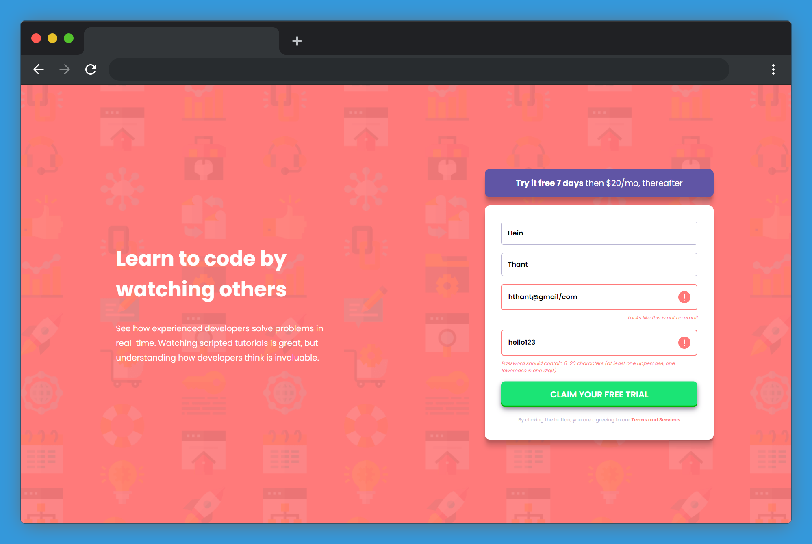

## 📋 Table of contents

- [🎫 Sign Up Form Component](#-sign-up-form-component)
  - [🔍 Overview](#-overview)
    - [🎯 Challenge](#-challenge)
    - [📸 Screenshot](#-screenshot)
    - [🔗 Links](#-links)
  - [🚂 My process](#-my-process)
    - [🧰 Built With](#-built-with)
    - [💡 What I learned](#-what-i-learned)
    - [🔭 Future features](#-future-features)
    - [💎 Useful resources](#-useful-resources)
  - [📧 Connect wit me](#-connect-wit-me)
  - [🤝 Contributing](#-contributing)
  - [💖 Show your support](#-show-your-support)
  - [📜 License ](#-license-)

# 🎫 Sign Up Form Component

This is a solution to the [Intro component with sign up form challenge on Frontend Mentor](https://www.frontendmentor.io/challenges/intro-component-with-signup-form-5cf91bd49edda32581d28fd1).

## 🔍 Overview

### 🎯 Challenge

Users should be able to:

- View the optimal layout for the site depending on their device's screen size
- See hover states for all interactive elements on the page
- Receive an error message when the `form` is submitted if:
  - Any `input` field is empty. The message for this error should say *"[Field Name] cannot be empty"*
  - The email address is not formatted correctly (i.e. a correct email address should have this structure: `name@host.tld`). The message for this error should say *"Looks like this is not an email"*

### 📸 Screenshot

### 🔗 Links

- Solution URL: [My Solution](#)
- Live Site URL: [Demo Website](https://indiecodermm.github.io/signup-form)

## 🚂 My process

### 🧰 Built With

- [React.js](https://reactjs.org/) - to create UI and dynamic components
- [Firebase](https://console.firebase.google.com/) - to store registration data

### 💡 What I learned

In this project, I learned:
- How to add Firebase to a React app
- How to use Firestore as a database for storing docs
- Using Regex to validate input values
- Improving UX with conditional class and components

### 🔭 Future features

- [x] Display list of registered users
- [ ] Loading and popup message
- [ ] Use this component in a real app

### 💎 Useful resources

- [React Chat App in 7 min](https://youtu.be/zQyrwxMPm88) - Using Firestore in React
- [React Firebase Hooks](https://github.com/CSFrequency/react-firebase-hooks/blob/master/firestore/README.md) - Documentation on firebase hooks
- [CSS Buttons Examples](https://getcssscan.com/css-buttons-examples) - Beautiful button styles
- [Password Validation](https://www.w3resource.com/javascript/form/password-validation.php) - Regex for password validation

## 📧 Connect wit me

I am always looking for ways to improve my project. If you have any suggestions or ideas, I would love to hear from you.
- GitHub - [IndieCoderMM](https://www.your-site.com)
- Frontend Mentor - [@IndieCoderMM](https://www.frontendmentor.io/profile/IndieCoderMM)
- Linkedin - [@hthantoo](https://www.linkedin.com/in/hthantoo/)
- Gmail - [hthant00chk@gmail.com](mailto:hthant00chk@gmail.com)

## 🤝 Contributing

I welcome any and all contributions to my website! If you have an idea for a new feature or have found a bug, please open an issue or submit a pull request.

Feel free to check the [issues page](../../issues/).

## 💖 Show your support
If you like this project, please consider giving it a ⭐.

## 📜 License 

This project is [MIT](./LICENSE) licensed.